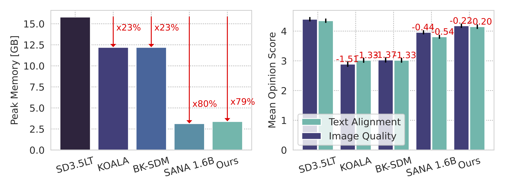
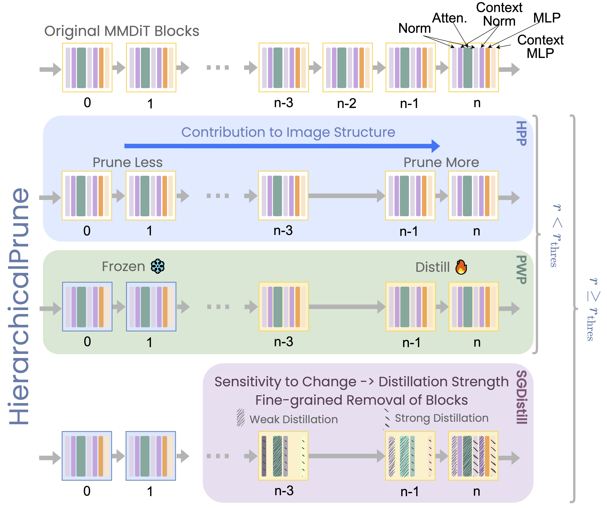

<p align="center">
  <h1 align="center">HierarchicalPrune: Position-Aware Compression for Large-Scale Diffusion Models</h1>
</p>

<p align="center">
  <a href="https://arxiv.org/pdf/2508.04663"></a>
  <a href="https://arxiv.org/abs/2508.04663"></a>
  <a href="https://samsunglabs.github.io/HierarchicalPrune/"></a>
  <a href="./LICENSE"></a>
</p>

<p align="center">
  
  
  
  
</p>
<p align="center">
  
  
  
  
</p>

## News

- (🔥 New) **\[2026/03/05\]** 🎉 Initial code release with distillation and evaluation support.

## Introduction

Recent large-scale diffusion models such as SD3.5 (8B) and FLUX (11B) deliver outstanding image quality, but their excessive memory and compute demands limit deployment on resource-constrained devices. Existing depth-pruning methods achieve reasonable compression on smaller U-Net-based models, yet fail to scale to these large MMDiT-based architectures without significant quality degradation.

**HierarchicalPrune** identifies a novel dual hierarchical structure in MMDiT-based diffusion models: an *inter-block* hierarchy (early blocks establish semantics, later blocks handle refinements) and an *intra-block* hierarchy (varying importance of subcomponents within each block). It exploits this structure through three principled techniques:

- **Hierarchical Position Pruning (HPP)**: strategically maintains early blocks that form core image structures while pruning later, less critical blocks
- **Positional Weight Preservation (PWP)**: freezes non-pruned early portions during distillation, preserving blocks essential for image formation
- **Sensitivity-Guided Distillation (SGDistill)**: applies inverse distillation weights, assigning minimal updates to the most important (and sensitive) blocks while concentrating learning on less sensitive components

Combined with INT4 quantisation, HierarchicalPrune achieves **77.5–80.4% memory reduction** with minimal quality loss (4.8–5.3% user-perceived image quality degradation compared to the original model) with 95% confidence intervals, significantly outperforming prior methods (11.1–52.2% degradation). A user study with 85 participants confirms the superiority of our approach.

<p align="center"></p>

## Method Overview

HierarchicalPrune's compression framework leverages MMDiT's two-fold hierarchy (*inter-block*: early blocks establish semantics, later blocks refine; *intra-block*: varying subcomponent importance). It comprises (1) Hierarchical Position Pruning (HPP), maintaining early blocks while pruning later ones, (2) Positional Weight Preservation (PWP), freezing critical early blocks during distillation, and (3) Sensitivity-Guided Distillation (SGDistill), applying inverse weights, providing minimal updates to sensitive blocks and subcomponents. The resulting framework enables effective compression while preserving model capabilities.

<p align="center"></p>

## Getting Started

- [Installation](#installation)
- [Distillation & Training](#distillation--training)
- [Inference](#inference)
- [Evaluation](#evaluation)
- [Contribution Analysis](#contribution-analysis)
- [Project Structure](#project-structure)

## Installation

```bash
git clone --recursive https://github.com/SamsungLabs/HierarchicalPrune.git
cd HierarchicalPrune
```

**Option 1: Using requirements.txt**

```bash
conda create -n hiprune python=3.11
conda activate hiprune
pip install -r requirements.txt
```

**Option 2: Using pyproject.toml**

```bash
conda create -n hiprune python=3.11
conda activate hiprune
pip install -e .
```

## Additional Setup

<details>
<summary>Metrics (Optional)</summary>

We provide two metrics for quantitative evaluation: **HPSv2** and **GenEval**. Both are configured via submodule.

To prepare the GenEval metric evaluation, you would need to ensure versions of the `mmcv-full` package and `cuda` to be matched. We have tested GenEval on A6000 GPUs with cuda/12.4. Here we share a full list of dependencies in `metrics/requirements_cu124.txt` for your reference.

Besides, GenEval requires additional package, `mmdetection`, to be installed and a pretrained model to be downloaded. Please run the following bash script.

```bash
cd metrics/
bash prepare_geneval.sh
```

</details>

<details>
<summary>Developer Setup</summary>

Install `pre-commit` for automatically checking formats, errors, linting, etc. to make development more error-prone and professional.

```bash
pre-commit install
```

Now `pre-commit` will run automatically on `git commit`.

</details>

## Distillation & Training

For running feature-level knowledge distillation, use the following script:

```bash
bash scripts/run_distil_sd3L_kd.sh
```

> \[NOTE\]
> Update `TRAIN_DATA_DIR` and `MODEL_CACHE_DIR` environment variables or edit the default paths in the script before running.

## Inference

For running inference to generate images using distilled or original transformers, use the following script:

```bash
bash scripts/infer_sd3.sh
```

The script includes examples for:

- Distilled transformer inference
- Original (teacher) transformer inference
- Quantized (W4A16) transformer inference

## Evaluation

For running evaluation with quantitative metrics (HPSv2 & GenEval), use the following script.

```bash
bash scripts/eval_sd3.sh
```

## Contribution Analysis

For running contribution analysis to analyse per-block contributions of the transformer model, use the following script.

```bash
bash scripts/cont_analysis_sd3L.sh
```

> \[NOTE\]
> To run evaluation and contribution analysis based on quantitative metrics (HPSv2 & GenEval), see [Additional Setup](#additional-setup).

## Project Structure

```
HierarchicalPrune/
├── assets/                           # assets (precomputed metrics, geneval model, etc.)
├── configs/                          # Training & validation configs
├── data/                             # Data loading utilities
├── docs/                             # Project page (GitHub Pages)
├── LICENSES/                         # Licenses of all relevant repositories
├── metrics/                          # Evaluation metrics (HPSv2, GenEval)
├── model/                            # Model related functions
├── notebooks/                        # Jupyter notebooks (inference memory profiling)
├── pipelines/                        # [Experimental] Custom DC-AE inference pipelines
├── profilers/                        # Memory & performance profiling
├── scripts/                          # Shell scripts for running experiments
└── utils/                            # Utility functions (args, quantize, etc.)
```

> \[NOTE\]
> **DC-AE** (Deep Compression Autoencoder) integration is experimental. The related code (`infer_dcae_sd3.py`, `pipelines/pipeline_dcae_*.py`, `model/dc_ae/`) is included but not part of the core HierarchicalPrune method.

## Acknowledgments

This codebase is built from [diffusers](https://github.com/huggingface/diffusers), in particular from this distillation code [Link](https://github.com/huggingface/diffusers/tree/main/examples/text_to_image), and from [BK-SDM](https://github.com/Nota-NetsPresso/BK-SDM). We also refer to [SANA](https://github.com/NVlabs/Sana) and [accelerate](https://github.com/huggingface/accelerate).

## Citation

If you find this work useful, please cite our paper:

```bibtex
@inproceedings{kwon2026hierarchicalprune,
    title     = {{HierarchicalPrune: Position-Aware Compression for Large-Scale Diffusion Models}},
    author    = {Kwon, Young D. and Li, Rui and Li, Sijia and Li, Da and Bhattacharya, Sourav and Venieris, Stylianos I.},
    booktitle = {Proceedings of the AAAI Conference on Artificial Intelligence (AAAI)},
    year      = {2026},
}
```

## Licenses

The license for our code can be found in [LICENSE](LICENSE). All the licenses of the repositories that we used their codes can be found [here](LICENSES).
